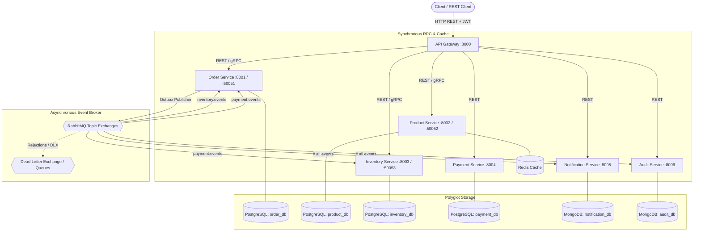
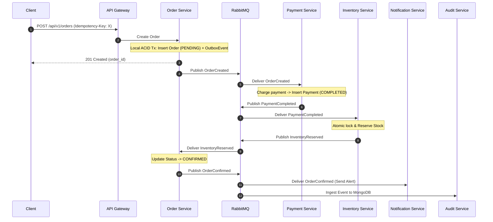
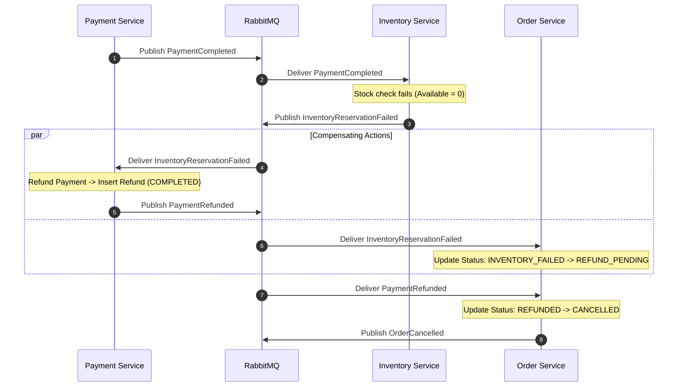

# Event-Driven Order Processing Platform

A production-grade, distributed **Event-Driven Order Processing Platform** built with **Python 3.12+**, **FastAPI**, **gRPC**, **Protocol Buffers**, **RabbitMQ**, **PostgreSQL**, **MongoDB**, **Redis**, and **Docker**.

Engineered from scratch to solve fundamental distributed systems challenges:
- **Dual-Write Problem**: Solved via the **Transactional Outbox Pattern**.
- **Distributed Consistency**: Solved via a **Choreographed Saga Pattern** with automated compensating rollbacks.
- **Race Conditions & Overselling**: Solved via **atomic conditional SQL updates and pessimistic row-level locking**.
- **At-Least-Once Redelivery Duplication**: Solved via **multi-tiered idempotency** (Redis distributed locks + PostgreSQL unique constraints).
- **Transient Failures & Poison Pills**: Handled via **RabbitMQ Dead Letter Exchanges (DLX), exponential backoff retries, and prefetch tuning**.
- **Polyglot Persistence**: PostgreSQL for transactional ACID guarantees, MongoDB for append-only audit event streams & notifications, Redis for cache-aside and rate limiting.

---

## Architecture Overview



---

## Technology Stack

| Component | Technology | Purpose |
| :--- | :--- | :--- |
| **Language** | Python 3.12+ | Core runtime |
| **Package Manager** | `uv` | Ultra-fast, reproducible dependency resolution (`pyproject.toml`, `uv.lock`) |
| **API Framework** | FastAPI | Async REST API endpoints with Pydantic v2 validation |
| **Internal RPC** | gRPC + Protocol Buffers | Low-latency binary communication over HTTP/2 |
| **Message Broker** | RabbitMQ (`aio-pika`) | Topic exchanges, durable queues, manual ACKs, DLQ |
| **Relational Database** | PostgreSQL (`asyncpg`, SQLAlchemy 2.x) | Database-per-service ACID transactional persistence |
| **Document Database** | MongoDB (`motor`, Beanie ODM) | Immutable event audit store and notification history |
| **Cache & Locks** | Redis (`redis.asyncio`) | Cache-aside, distributed idempotency locks, rate limiting |
| **Containerization** | Docker, Docker Compose | Multi-container local orchestration and deployment |
| **Reverse Proxy** | Nginx | Reverse proxy, rate limiting, and SSL termination |

---

## Microservices Breakdown

| Service | Port / gRPC | Storage | Core Responsibilities |
| :--- | :--- | :--- | :--- |
| **API Gateway** | `8000` | Redis | Single entry point, JWT validation, rate limiting, correlation ID propagation, routing. |
| **Order Service** | `8001` / `50051` | PostgreSQL (`order_db`) | Order lifecycle state machine, Transactional Outbox pattern, Saga orchestration. |
| **Product Service** | `8002` / `50052` | PostgreSQL (`product_db`) + Redis | Catalog management, Redis cache-aside queries, gRPC validation. |
| **Inventory Service** | `8003` / `50053` | PostgreSQL (`inventory_db`) | High-concurrency stock reservation, pessimistic locking, Saga auto-release. |
| **Payment Service** | `8004` / `50054` | PostgreSQL (`payment_db`) | Deterministic payment simulation, refund processing, idempotency guards. |
| **Notification Service** | `8005` | MongoDB (`notification_db`) | Asynchronous email/SMS simulation and communication history. |
| **Audit Service** | `8006` | MongoDB (`audit_db`) | Append-only domain event ledger, distributed correlation trace reconstruction. |

---

## Distributed Saga Lifecycle

### 1. Happy Path (Order Succeeded)


### 2. Failure & Compensation Path (Out of Stock)


---

## Quick Start & Local Setup

### Prerequisites
- Python 3.12+
- `uv` package manager (`curl -LsSf https://astral.sh/uv/install.sh | sh`)
- Docker & Docker Compose

### 1. Clone & Install Dependencies
```bash
git clone https://github.com/<username>/event-driven-order-platform.git
cd event-driven-order-platform

# Install dependencies using uv
uv sync
```

### 2. Compile Protocol Buffers
```bash
make compile-proto
# or: uv run python scripts/compile_proto.py
```

### 3. Run the Test Suite
```bash
make test
# or: uv run pytest -v
```
All 14 tests (including the 50-concurrent-buyer race condition test and Saga integration workflows) will execute with SQLite in-memory fixtures.

### 4. Run Locally with Docker Compose
```bash
# Start all microservices, databases, RabbitMQ, and Nginx
docker compose up -d --build

# Verify container status
docker compose ps
```

Explore the interactive Swagger UI at:
- **API Gateway (Unified Swagger)**: [http://localhost:8000/docs](http://localhost:8000/docs)
- **RabbitMQ Management Console**: [http://localhost:15672](http://localhost:15672) (User: `guest`, Pass: `guest`)

---

## Complete API Walkthrough

### 1. Authenticate & Obtain JWT Token
```bash
curl -X POST http://localhost:8000/api/v1/auth/token \
  -H "Content-Type: application/json" \
  -d '{"username": "alice", "password": "password123", "role": "customer"}'
```

### 2. Create a Product
```bash
curl -X POST http://localhost:8000/api/v1/products \
  -H "Content-Type: application/json" \
  -d '{
    "name": "MacBook Pro 16",
    "description": "Apple M3 Max, 36GB RAM, 1TB SSD",
    "sku": "MBP-16-M3",
    "price": 2499.00,
    "currency": "USD",
    "is_active": true
  }'
```

### 3. Initialize Inventory Stock
```bash
curl -X POST http://localhost:8000/api/v1/inventory/initialize \
  -H "Content-Type: application/json" \
  -d '{
    "product_id": "<PRODUCT_ID_FROM_STEP_2>",
    "quantity": 10
  }'
```

### 4. Place an Order with Idempotency Key
```bash
curl -X POST http://localhost:8000/api/v1/orders \
  -H "Content-Type: application/json" \
  -H "Idempotency-Key: 7b7b837b-order-001" \
  -d '{
    "customer_id": "cust_alice",
    "items": [{"product_id": "<PRODUCT_ID_FROM_STEP_2>", "quantity": 1}],
    "payment_method": "CREDIT_CARD",
    "simulation_flag": "SUCCESS"
  }'
```

### 5. Inspect Distributed Audit Trail
```bash
curl http://localhost:8000/api/v1/audit/events
```

---

## Project Documentation Index

- [Architecture & High-Level Design](docs/architecture.md)
- [Database Schema & Polyglot Persistence](docs/database-design.md)
- [Domain Event Catalog](docs/event-catalog.md)
- [gRPC & Protocol Buffer Contracts](docs/grpc-contracts.md)
- [RabbitMQ Broker & DLQ Topology](docs/rabbitmq.md)
- [Failure Handling & Saga Compensation](docs/failure-handling.md)
- [Production Deployment Guide](docs/deployment.md)
- [SDE-2 Distributed Systems Interview Preparation](docs/interview-preparation.md)

---

## License
MIT License. Free for commercial and portfolio showcase use.
