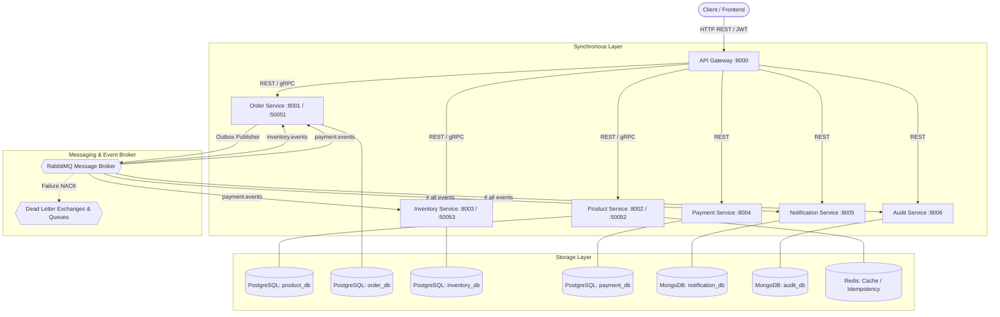

# System Architecture & Design

## 1. High-Level Architecture

The **Event-Driven Order Processing Platform** is architected as an autonomous set of microservices adhering strictly to the **Database-per-Service** and **Event-Driven Architecture (EDA)** principles.

---

## 2. Core Architectural Patterns

### 2.1 Database-per-Service
No microservice shares tables, schemas, or database instances with another microservice. Data ownership is strictly decoupled. Any cross-service data queries occur via gRPC or asynchronous events.

### 2.2 Transactional Outbox Pattern
To prevent dual-write anomalies (writing to DB and publishing to message broker non-atomically), the `Order Service` persists both domain entities and an `OutboxEvent` within the same local ACID transaction. An independent background worker polls unpublished outbox records and guarantees at-least-once message delivery to RabbitMQ.

### 2.3 Choreographed Saga Pattern with Compensation
Distributed workflows (e.g., checkout) are handled as a Saga. If a downstream step fails (such as stock depletion in Inventory Service), a compensating event (`PaymentRefundRequested` / `InventoryReservationFailed`) triggers the upstream rollback (Payment Refund & Order Cancellation).

### 2.4 Multi-Layered Idempotency
- **API Level**: Redis atomic `SETNX` distributed locks using `Idempotency-Key` headers.
- **Database Level**: Unique constraint indices on `idempotency_key` and `processed_events(event_id)`.
- **Consumer Level**: Idempotency filters verify message IDs before executing business logic.
