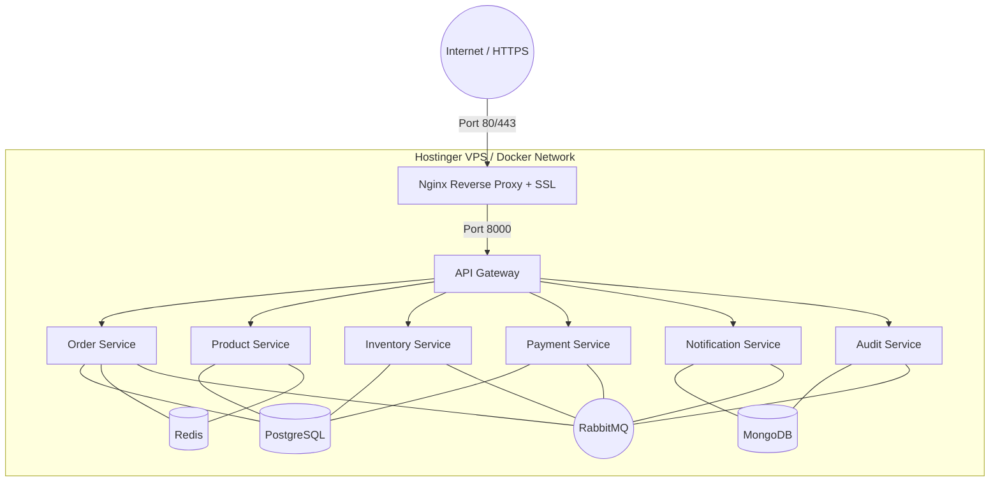

# Production Deployment Guide (Hostinger VPS / Linux Server)

## 1. Deployment Topology



---

## 2. Step-by-Step VPS Provisioning

### Step 1: VPS Setup & Security
1. Log into VPS via SSH:
   ```bash
   ssh root@<VPS_IP>
   ```
2. Update system packages & install Docker + Docker Compose:
   ```bash
   apt-get update && apt-get upgrade -y
   apt-get install -y curl git ufw
   curl -fsSL https://get.docker.com | sh
   ```
3. Configure UFW Firewall:
   ```bash
   ufw default deny incoming
   ufw default allow outgoing
   ufw allow 22/tcp
   ufw allow 80/tcp
   ufw allow 443/tcp
   ufw enable
   ```

### Step 2: Clone & Configure Environment
1. Clone the repository:
   ```bash
   git clone <REPO_URL> /opt/order-platform
   cd /opt/order-platform
   ```
2. Copy and customize production environment variables:
   ```bash
   cp .env.example .env
   # Edit .env with strong passwords, production JWT secrets, and hostnames
   nano .env
   ```

### Step 3: Launch with Docker Compose
```bash
docker compose up -d --build
```

### Step 4: Verify Deployment Health
```bash
curl http://localhost/health
docker compose ps
```

---

## 3. Data Persistence & Backup Strategy

All stateful containers use named Docker volumes:
- `postgres_data` -> `/var/lib/postgresql/data`
- `mongo_data` -> `/data/db`
- `redis_data` -> `/data`
- `rabbitmq_data` -> `/var/lib/rabbitmq`

### Automated Daily Database Backup Script:
```bash
#!/bin/bash
BACKUP_DIR="/var/backups/order-platform/$(date +%Y%m%d)"
mkdir -p "$BACKUP_DIR"

# PostgreSQL Backup
docker exec order_platform_postgres pg_dumpall -U postgres | gzip > "$BACKUP_DIR/postgres_all.sql.gz"

# MongoDB Backup
docker exec order_platform_mongodb mongodump --archive --gzip > "$BACKUP_DIR/mongo_all.archive.gz"
```
