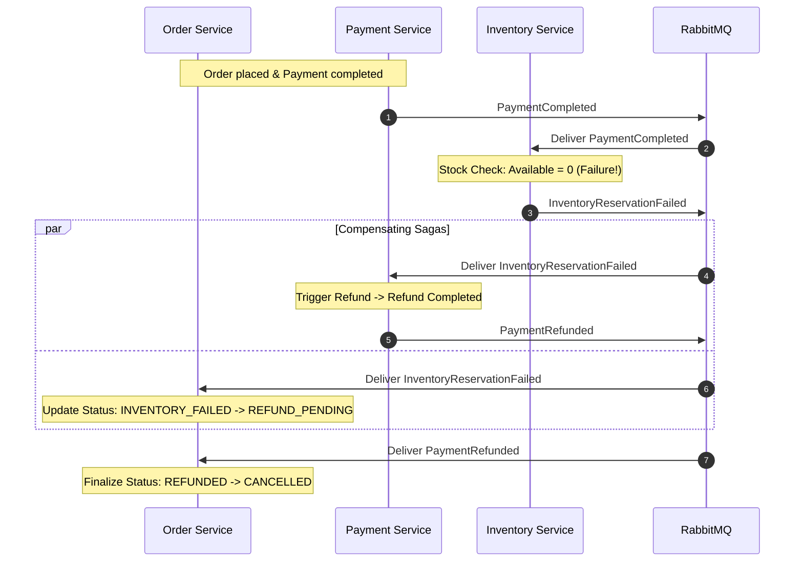

# Failure Handling, Compensation & Resilience

## 1. Failure Scenarios & Mitigations

---

## 2. Distributed Systems Failure Matrix

| Failure Mode | Root Cause | System Response & Mitigation |
| :--- | :--- | :--- |
| **Dual-Write Crash** | App crashes after DB commit but before publishing to broker. | **Transactional Outbox**: Outbox row was committed in the same ACID transaction. Background worker resumes and publishes after recovery. |
| **Duplicate Message Delivery** | Broker redelivers unacknowledged message. | **Idempotency Guard**: Service checks `processed_events` table before executing logic. If present, ACK immediately without side effects. |
| **Insufficient Inventory** | Product stock exhausted by concurrent buyers. | **Compensating Action**: Inventory publishes `InventoryReservationFailed`, triggering automated payment refund and order cancellation. |
| **Redis Outage** | Redis container or cluster goes offline. | **Graceful Fallback**: Cache-aside queries fallback to PostgreSQL. Idempotency falls back to PostgreSQL unique index constraint. |
| **Poison Pill Message** | Malformed JSON or invalid schema in queue. | **DLQ Routing**: Message is rejected with `requeue=False` and diverted to Dead Letter Queue (`dlx.events`) after max retries. |
| **Concurrent Overselling** | 100 buyers simultaneously requesting last 1 unit. | **Atomic Conditional Update / Row Lock**: Only 1 transaction increments `reserved_quantity`; remaining 99 receive `InsufficientStockException`. |
