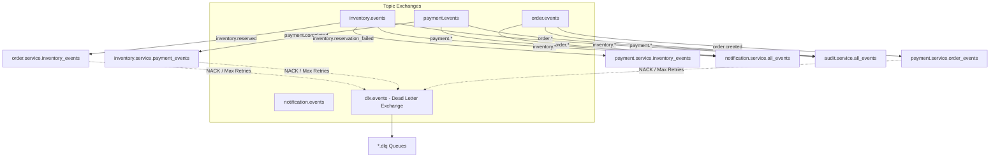

# RabbitMQ Broker Architecture & Reliability

## 1. Exchange Topology

The platform configures dedicated durable **Topic Exchanges** to enable fine-grained pattern-based routing and fanout capabilities:



---

## 2. Key Reliability Configurations

### 2.1 Durable Exchanges & Persistent Messages
All exchanges and queues are declared with `durable=True`. When publishing messages via `aio-pika`, messages specify `delivery_mode=aio_pika.DeliveryMode.PERSISTENT` so that messages are written to disk and survive RabbitMQ broker restarts.

### 2.2 Manual Acknowledgements (ACK / NACK)
Consumers process incoming messages within an explicit context. 
- If handler succeeds: `await message.ack()` is invoked.
- If unhandled or unrecoverable error occurs: `await message.reject(requeue=False)` routes the payload directly to the **Dead Letter Exchange (DLX)**, preventing poison-pill messages from infinite crash loops.

### 2.3 Prefetch Limits (QoS)
Channels set `channel.set_qos(prefetch_count=10)` to prevent a single slow consumer from being overwhelmed while other consumer replicas sit idle.

### 2.4 Dead-Letter Queues (DLQ)
Every domain queue is initialized with:
```python
queue_args = {
    "x-dead-letter-exchange": "dlx.events",
}
```
Failed or rejected messages are quarantined into dedicated `.dlq` queues for operator inspection and replay.
